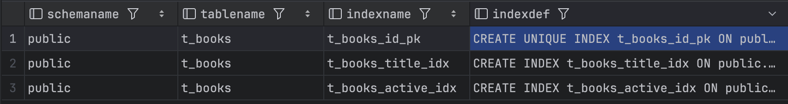
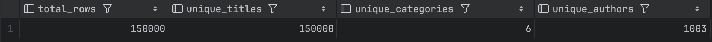
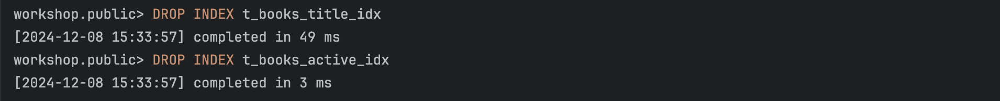

# Задание 1. B-tree индексы в PostgreSQL

1. Запустите БД через docker compose в ./src/docker-compose.yml:

2. Выполните запрос для поиска книги с названием 'Oracle Core' и получите план выполнения:
   ```sql
   EXPLAIN ANALYZE
   SELECT * FROM t_books WHERE title = 'Oracle Core';
   ```
   
   *План выполнения:*
   ```sql
   Seq Scan on t_books  (cost=0.00..3100.00 rows=1 width=33) (actual time=86.951..86.952 rows=1 loops=1)
   Filter: ((title)::text = 'Oracle Core'::text)
   Rows Removed by Filter: 149999
   Planning Time: 5.256 ms
   Execution Time: 87.336 ms
   ```
   
   *Объясните результат:*

   Запрос к `t_books` выполнялся с использованием последовательного сканирования `Seq Scan`. Это означает, что 
   БД проверяла каждую строку таблицы, чтобы найти соответствие условию фильтрации по заголовку `'Oracle Core'`.
   Время выполнения запроса составило `87.336 мс`, что не очень много, но для больших таблиц использование 
   `Seq Scan` может быть привести к увеличению временных затрат

3. Создайте B-tree индексы:
   ```sql
   CREATE INDEX t_books_title_idx ON t_books(title);
   CREATE INDEX t_books_active_idx ON t_books(is_active);
   ```
   
   *Результат:*
   ```sql
   workshop.public> CREATE INDEX t_books_title_idx ON t_books(title)
   [2024-12-08 14:41:26] completed in 359 ms
   workshop.public> CREATE INDEX t_books_active_idx ON t_books(is_active)
   [2024-12-08 14:41:26] completed in 53 ms
   ```

4. Проверьте информацию о созданных индексах:
   ```sql
   SELECT schemaname, tablename, indexname, indexdef
   FROM pg_catalog.pg_indexes
   WHERE tablename = 't_books';
   ```
   
   *Результат:*
    

   *Объясните результат:*

   Для таблицы `t_books` в схеме `public` были успешно созданы три индекса: уникальный индекс `t_books_id_pk` на 
   столбце `book_id`, который обеспечивает уникальность значений в этом столбце, и два обычных индекса — 
   `t_books_title_idx` на столбце `title` и `t_books_active_idx` на столбце `is_active`. Эти индексы используют 
   структуру `B-tree`, что позволяет ускорить выполнение запросов, фильтрующих или сортирующих данные по указанным 
   столбцам, тем самым улучшая производительность операций выборки и поиска в таблице

5. Обновите статистику таблицы:
   ```sql
   ANALYZE t_books;
   ```
   
   *Результат:*
   ```sql
   workshop.public> ANALYZE t_books
   [2024-12-08 14:50:51] completed in 133 ms 
   ```

6. Выполните запрос для поиска книги 'Oracle Core' и получите план выполнения:
   ```sql
   EXPLAIN ANALYZE
   SELECT * FROM t_books WHERE title = 'Oracle Core';
   ```
   
   *План выполнения:*
   ```sql
   Index Scan using t_books_title_idx on t_books  (cost=0.42..8.44 rows=1 width=33) (actual time=0.460..0.467 rows=1 loops=1)
   Index Cond: ((title)::text = 'Oracle Core'::text)
   Planning Time: 2.644 ms
   Execution Time: 0.636 ms
   ```
   
   *Объясните результат:*
   Запрос на поиск книги с заголовком `'Oracle Core'` использовал индексное сканирование `Index Scan` с индексом 
   `t_books_title_idx`, что обеспечило высокую эффективность выполнения. Оценка стоимости операции была низкой, и 
   фактическое время выполнения составило всего `0.636 мс`, что свидетельствует о быстром доступе к данным. 
   Ожидалось, что время планирования составит `2.644 мс`. В целом, использование индекса позволило значительно ускорить
   выполнение запроса по сравнению с последовательным сканированием


7. Выполните запрос для поиска книги по book_id и получите план выполнения:
   ```sql
   EXPLAIN ANALYZE
   SELECT * FROM t_books WHERE book_id = 18;
   ```
   
   *План выполнения:*
   ```sql
   Index Scan using t_books_id_pk on t_books  (cost=0.42..8.44 rows=1 width=33) (actual time=4.083..4.107 rows=1 loops=1)
   Index Cond: (book_id = 18)
   Planning Time: 2.227 ms
   Execution Time: 5.216 ms
   ```
   
   *Объясните результат:*
    
   Запрос на поиск строки с `book_id = 18` использовал индексное сканирование `Index Scan` с индексом `t_books_id_pk`, 
   что обеспечило эффективный доступ к данным. Фактическое время выполнения составило `5.216 мс`, из которых `4.083 мс`
   было затрачено на выполнение операции, что указывает на быструю обработку запроса. Время планирования составило 
   `2.227 мс`, что также является приемлемым значением. Использование индекса позволило быстро найти нужную строку


8. Выполните запрос для поиска активных книг и получите план выполнения:
   ```sql
   EXPLAIN ANALYZE
   SELECT * FROM t_books WHERE is_active = true;
   ```
   
   *План выполнения:*
   ```sql
   Seq Scan on t_books  (cost=0.00..2725.00 rows=75675 width=33) (actual time=0.052..33.074 rows=75001 loops=1)
   Filter: is_active
   Rows Removed by Filter: 74999
   Planning Time: 1.958 ms
   Execution Time: 35.512 ms
   ```
   
   *Объясните результат:*

   Запрос к таблице `t_books` выполнялся с `Seq Scan`. Оценка стоимости операции составила `2725.00`, с ожидаемым 
   количеством возвращаемых строк равным `75675`, однако фактически было возвращено только `75001` строк, что указывает на
   то, что фильтрация была применена к большому количеству строк. Время выполнения запроса составило `28.826 мс`, что 
   намного больше предыдущего результата


9. Посчитайте количество строк и уникальных значений:
   ```sql
   SELECT 
       COUNT(*) as total_rows,
       COUNT(DISTINCT title) as unique_titles,
       COUNT(DISTINCT category) as unique_categories,
       COUNT(DISTINCT author) as unique_authors
   FROM t_books;
   ```
   
   *Результат:*
    

10. Удалите созданные индексы:
    ```sql
    DROP INDEX t_books_title_idx;
    DROP INDEX t_books_active_idx;
    ```
    
    *Результат:*
     

11. Основываясь на предыдущих результатах, создайте индексы для оптимизации следующих запросов:
    a. `WHERE title = $1 AND category = $2`
    b. `WHERE title = $1`
    c. `WHERE category = $1 AND author = $2`
    d. `WHERE author = $1 AND book_id = $2`
    
    *Созданные индексы:*
    ```sql
    a) CREATE INDEX idx_title_category ON t_books(title, category);
    ```
    ```sql
    b) CREATE INDEX idx_title ON t_books(title);
    ```
    ```sql
    c) CREATE INDEX idx_category_author ON t_books(category, author);
    ```
    ```sql
    d) CREATE INDEX idx_author_book_id ON t_books(author, book_id);
    ```
    
    *Объясните ваше решение:*
   
   Каждый запрос по аналогии создает индексы для оптимизации запросов

12. Протестируйте созданные индексы.
    
    *Результаты тестов:*
    ```sql
    a) 
    EXPLAIN ANALYZE
    SELECT * FROM t_books WHERE title = 'Oracle Core' AND category = 'Databases';
    ```
    ```sql
    Index Scan using idx_category_author on t_books  (cost=0.29..8.23 rows=1 width=33) (actual time=0.173..0.180 rows=1 loops=1)
    Index Cond: ((category)::text = 'Databases'::text)
    Filter: ((title)::text = 'Oracle Core'::text)
    Rows Removed by Filter: 2
    Planning Time: 2.382 ms
    Execution Time: 0.260 ms
    ```
    
    ```sql
    b)
    EXPLAIN ANALYZE
    SELECT * FROM t_books WHERE title = 'Oracle Core';
    ```
    ```sql
    Index Scan using idx_title on t_books  (cost=0.42..8.44 rows=1 width=33) (actual time=0.988..0.995 rows=1 loops=1)
    Index Cond: ((title)::text = 'Oracle Core'::text)
    Planning Time: 0.926 ms
    Execution Time: 1.076 ms
    ```
    
    ```sql
    c)
    EXPLAIN ANALYZE
    SELECT * FROM t_books WHERE category = 'Databases' AND author = 'Jonathan Lewis';
    ```
    ```sql
    Index Scan using idx_category_author on t_books  (cost=0.29..8.23 rows=1 width=33) (actual time=0.248..0.265 rows=1 loops=1)
    Index Cond: (((category)::text = 'Databases'::text) AND ((author)::text = 'Jonathan Lewis'::text))
    Planning Time: 0.604 ms
    Execution Time: 0.358 ms
    ```
    
    ```sql
    d)
    EXPLAIN ANALYZE
    SELECT * FROM t_books WHERE book_id = 3001 AND author = 'Jonathan Lewis';
    ```
    ```sql
    Index Scan using idx_author_book_id on t_books  (cost=0.42..8.44 rows=1 width=33) (actual time=1.295..1.323 rows=1 loops=1)
    Index Cond: (((author)::text = 'Jonathan Lewis'::text) AND (book_id = 3001))
    Planning Time: 0.559 ms
    Execution Time: 1.401 ms
    ```
    
    *Объясните результаты:*

    Все запросы показали низкое время выполнения и эффективное использование индексов, что свидетельствует о хорошей 
    производительности


13. Выполните регистронезависимый поиск по началу названия:
    ```sql
    EXPLAIN ANALYZE
    SELECT * FROM t_books WHERE title ILIKE 'Relational%';
    ```
    
    *План выполнения:*
    ```sql
    Seq Scan on t_books  (cost=0.00..3100.00 rows=15 width=33) (actual time=99.116..99.121 rows=0 loops=1)
    Filter: ((title)::text ~~* 'Relational%'::text)
    Rows Removed by Filter: 150000
    Planning Time: 16.454 ms
    Execution Time: 100.067 ms
    ```
    *Объясните результат:*

    Оценка стоимости операции составила `3100.00`, с ожидаемым количеством возвращаемых строк равным `15`, но фактически
    не было найдено ни одной строки, соответствующей условию. Время выполнения запроса составило `100.067 мс`, что 
    указывает на значительные затраты времени, особенно учитывая, что было удалено 150000 строк, которые не 
    соответствовали фильтру 


14. Создайте функциональный индекс:
    ```sql
    CREATE INDEX t_books_up_title_idx ON t_books(UPPER(title));
    ```
    
    *Результат:*
    

15. Выполните запрос из шага 13 с использованием UPPER:
    ```sql
    EXPLAIN ANALYZE
    SELECT * FROM t_books WHERE UPPER(title) LIKE 'RELATIONAL%';
    ```
    
    *План выполнения:*
    ```sql
    Seq Scan on t_books  (cost=0.00..3475.00 rows=750 width=33) (actual time=79.588..79.594 rows=0 loops=1)
    Filter: (upper((title)::text) ~~ 'RELATIONAL%'::text)
    Rows Removed by Filter: 150000
    Planning Time: 5.918 ms
    Execution Time: 79.762 ms
    ```
    
    *Объясните результат:*

    Хоть и был создан индекс `t_books_up_title_idx` система не использовала его для выполнения данного запроса, 
    в результате чего время выполнения осталось таким же, как и без индекса.

16. Выполните поиск подстроки:
    ```sql
    EXPLAIN ANALYZE
    SELECT * FROM t_books WHERE title ILIKE '%Core%';
    ```
    
    *План выполнения:*
    ```sql
    Seq Scan on t_books  (cost=0.00..3100.00 rows=15 width=33) (actual time=85.361..85.370 rows=1 loops=1)
    Filter: ((title)::text ~~* '%Core%'::text)
    Rows Removed by Filter: 149999
    Planning Time: 1.189 ms
    Execution Time: 85.567 ms
    ```
    
    *Объясните результат:*

    Оценка стоимости операции составила `3100.00`, с ожидаемым количеством возвращаемых строк равным `15`, но фактически
    была найдена только `1` строка, соответствующая условию. Время выполнения запроса составило `85.567 мс`, что 
    указывает на значительные затраты времени, особенно учитывая, что было удалено `149999` строк, которые не 
    соответствовали фильтру


17. Попробуйте удалить все индексы:
    ```sql
    DO $$ 
    DECLARE
        r RECORD;
    BEGIN
        FOR r IN (SELECT indexname FROM pg_indexes 
                  WHERE tablename = 't_books' 
                  AND indexname != 'books_pkey')
        LOOP
            EXECUTE 'DROP INDEX ' || r.indexname;
        END LOOP;
    END $$;
    ```
    
    *Результат:*
    
    
    *Объясните результат:*
    Индекс `t_books_id_pk` необходим для поддержания уникальности `primary key` и ассоциирован с одноимённым ограничением `t_books_id_pk`.


18. Создайте индекс для оптимизации суффиксного поиска:
    ```sql
    -- Вариант 1: с reverse()
    CREATE INDEX t_books_rev_title_idx ON t_books(reverse(title));
    
    -- Вариант 2: с триграммами
    CREATE EXTENSION IF NOT EXISTS pg_trgm;
    CREATE INDEX t_books_trgm_idx ON t_books USING gin (title gin_trgm_ops);
    ```
    
    *Результаты тестов:*
    ```sql
    Seq Scan on t_books  (cost=0.00..3475.00 rows=750 width=33) (actual time=48.758..48.758 rows=0 loops=1)
    Filter: (upper((title)::text) ~~ 'RELATIONAL%'::text)
    Rows Removed by Filter: 150000
    Planning Time: 0.165 ms
    Execution Time: 70.774 ms
    
    Bitmap Heap Scan on t_books  (cost=95.15..150.36 rows=15 width=33) (actual time=0.039..0.040 rows=0 loops=1)
    Recheck Cond: ((title)::text ~~* 'Relational%'::text)
    Rows Removed by Index Recheck: 1
    Heap Blocks: exact=1
    ->  Bitmap Index Scan on t_books_trgm_idx  (cost=0.00..95.15 rows=15 width=0) (actual time=0.029..0.029 rows=1 loops=1)
        Index Cond: ((title)::text ~~* 'Relational%'::text)
    Planning Time: 0.338 ms
    Execution Time: 0.084 ms
    ```
    
    *Объясните результаты:*
    
    В первом случае запрос к таблице `t_books` выполнялся с `Seq Scan`, что привело к значительным затратам времени
    и отсутствию найденных строк, так как было удалено 150000 строк, не соответствующих условию фильтрации. Во втором 
    случае использовалось более эффективное битовое сканирование `Bitmap Heap Scan` с индексом `t_books_trgm_idx`, что 
    позволило быстро найти 1 строку за всего 0.084 мс, демонстрируя значительное улучшение производительности благодаря
    использованию индекса для текстовых фильтров


19. Выполните поиск по точному совпадению:
    ```sql
    EXPLAIN ANALYZE
    SELECT * FROM t_books WHERE title = 'Oracle Core';
    ```
    
    *План выполнения:*
    ```sql
    Index Scan using idx_title on t_books  (cost=0.42..8.44 rows=1 width=33) (actual time=0.146..0.155 rows=1 loops=1)
    Index Cond: ((title)::text = 'Oracle Core'::text)
    Planning Time: 1.995 ms
    Execution Time: 0.452 ms
    ```
    
    *Объясните результат:*

    Запрос к таблице t_books использовал индексное сканирование `Index Scan` с индексом `idx_title`, что обеспечило эффективный доступ к данным


20. Выполните поиск по началу названия:
    ```sql
    EXPLAIN ANALYZE
    SELECT * FROM t_books WHERE title ILIKE 'Relational%';
    ```
    
    *План выполнения:*
    ```sql
    Bitmap Heap Scan on t_books  (cost=95.15..150.36 rows=15 width=33) (actual time=0.642..0.649 rows=0 loops=1)
    Recheck Cond: ((title)::text ~~* 'Relational%'::text)
    Rows Removed by Index Recheck: 1
    Heap Blocks: exact=1
    ->  Bitmap Index Scan on t_books_trgm_idx  (cost=0.00..95.15 rows=15 width=0) (actual time=0.482..0.489 rows=1 loops=1)
        Index Cond: ((title)::text ~~* 'Relational%'::text)
    Planning Time: 1.722 ms
    Execution Time: 0.843 ms
    ```
    
    *Объясните результат:*

    Применение триграммного индекса с оператором `ILIKE` существенно ускоряет поиск строк, начинающихся с 
    определенного текста, по сравнению с последовательным сканированием таблицы. Триграммы позволяют эффективно 
    обрабатывать текстовые запросы, даже если они не учитывают регистр символов


21. Создайте свой пример индекса с обратной сортировкой:
    ```sql
    CREATE INDEX t_books_desc_idx ON t_books(title DESC);
    ```
    
    *Тестовый запрос:*
    ```sql
    EXPLAIN ANALYZE
    SELECT * FROM t_books ORDER BY title DESC LIMIT 10;
    ```
    
    *План выполнения:*
    ```sql
    Limit  (cost=0.42..1.02 rows=10 width=33) (actual time=0.551..0.598 rows=10 loops=1)
    ->  Index Scan using t_books_desc_idx on t_books  (cost=0.42..9061.52 rows=150000 width=33) (actual time=0.549..0.595 rows=10 loops=1)
    Planning Time: 1.743 ms
    Execution Time: 0.634 ms
    ```
    
    *Объясните результат:*

    Индекс с обратной сортировкой эффективен для запросов с `ORDER BY DESC`, так как он позволяет избежать 
    дополнительной сортировки, что сокращает время выполнения и затраты. Он особенно полезен в сочетании с `LIMIT`, 
    поскольку данные уже извлекаются в нужном порядке
