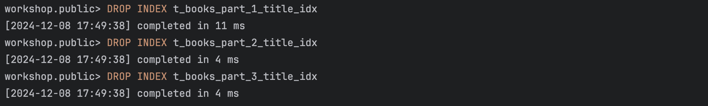

# Задание 2: Специальные случаи использования индексов

# Партиционирование и специальные случаи использования индексов

1. Удалите прошлый инстанс PostgreSQL - `docker-compose down` в папке `src` и запустите новый: `docker-compose up -d`.

2. Создайте партиционированную таблицу и заполните её данными:

    ```sql
    -- Создание партиционированной таблицы
    CREATE TABLE t_books_part (
        book_id     INTEGER      NOT NULL,
        title       VARCHAR(100) NOT NULL,
        category    VARCHAR(30),
        author      VARCHAR(100) NOT NULL,
        is_active   BOOLEAN      NOT NULL
    ) PARTITION BY RANGE (book_id);

    -- Создание партиций
    CREATE TABLE t_books_part_1 PARTITION OF t_books_part
        FOR VALUES FROM (MINVALUE) TO (50000);

    CREATE TABLE t_books_part_2 PARTITION OF t_books_part
        FOR VALUES FROM (50000) TO (100000);

    CREATE TABLE t_books_part_3 PARTITION OF t_books_part
        FOR VALUES FROM (100000) TO (MAXVALUE);

    -- Копирование данных из t_books
    INSERT INTO t_books_part 
    SELECT * FROM t_books;
    ```

3. Обновите статистику таблиц:
   ```sql
   ANALYZE t_books;
   ANALYZE t_books_part;
   ```
   
   *Результат:*
   

4. Выполните запрос для поиска книги с id = 18:
   ```sql
   EXPLAIN ANALYZE
   SELECT * FROM t_books_part WHERE book_id = 18;
   ```
   
   *План выполнения:*
    ```sql
   Seq Scan on t_books_part_1 t_books_part  (cost=0.00..1032.99 rows=1 width=32) (actual time=0.032..10.053 rows=1 loops=1)
    Filter: (book_id = 18)
    Rows Removed by Filter: 49998
    Planning Time: 1.814 ms
    Execution Time: 10.143 ms
    ```
   
   *Объясните результат:*
   
    Запрос искал `book_id = 18` в партиции `t_books_part_1` (от MINVALUE до 50000). Благодаря диапазонам PostgreSQL 
    направил его в нужную партицию. В ней использовалось последовательное сканирование `Seq Scan` из-за отсутствия 
    индекса на `book_id`


5. Выполните поиск по названию книги:
   ```sql
   EXPLAIN ANALYZE
   SELECT * FROM t_books_part 
   WHERE title = 'Expert PostgreSQL Architecture';
   ```
   
   *План выполнения:*
   ```sql
    Append  (cost=0.00..3099.01 rows=3 width=33) (actual time=12.379..26.880 rows=1 loops=1)
    ->  Seq Scan on t_books_part_1  (cost=0.00..1032.99 rows=1 width=32) (actual time=12.378..12.379 rows=1 loops=1)
        Filter: ((title)::text = 'Expert PostgreSQL Architecture'::text)
        Rows Removed by Filter: 49998
    ->  Seq Scan on t_books_part_2  (cost=0.00..1033.00 rows=1 width=33) (actual time=9.435..9.435 rows=0 loops=1)
        Filter: ((title)::text = 'Expert PostgreSQL Architecture'::text)
        Rows Removed by Filter: 50000
    ->  Seq Scan on t_books_part_3  (cost=0.00..1033.01 rows=1 width=34) (actual time=5.055..5.056 rows=0 loops=1)
        Filter: ((title)::text = 'Expert PostgreSQL Architecture'::text)
        Rows Removed by Filter: 50001
    Planning Time: 1.334 ms
    Execution Time: 27.058 ms
   ```
   
   *Объясните результат:*

   Оптимизатор рассмотрел все три партиции, поскольку не было создано индекса, который мог бы ускорить поиск по столбцу
    `title`. В результате в каждой из партиций было выполнено последовательное сканирование, при этом применялась 
    фильтрация данных для получения нужных результатов. Это привело к тому, что процесс поиска занял больше времени, 
    чем если бы индекс был доступен


6. Создайте партиционированный индекс:
   ```sql
   CREATE INDEX ON t_books_part(title);
   ```
   
   *Результат:*
   

7. Повторите запрос из шага 5:
   ```sql
   EXPLAIN ANALYZE
   SELECT * FROM t_books_part 
   WHERE title = 'Expert PostgreSQL Architecture';
   ```
   
   *План выполнения:*
   ```sql
    Append  (cost=0.29..24.94 rows=3 width=33) (actual time=5.491..8.695 rows=1 loops=1)
    ->  Index Scan using t_books_part_1_title_idx on t_books_part_1  (cost=0.29..8.31 rows=1 width=32) (actual time=5.490..5.839 rows=1 loops=1)
        Index Cond: ((title)::text = 'Expert PostgreSQL Architecture'::text)
    ->  Index Scan using t_books_part_2_title_idx on t_books_part_2  (cost=0.29..8.31 rows=1 width=33) (actual time=2.679..2.679 rows=0 loops=1)
        Index Cond: ((title)::text = 'Expert PostgreSQL Architecture'::text)
    ->  Index Scan using t_books_part_3_title_idx on t_books_part_3  (cost=0.29..8.31 rows=1 width=34) (actual time=0.163..0.163 rows=0 loops=1)
        Index Cond: ((title)::text = 'Expert PostgreSQL Architecture'::text)
    Planning Time: 9.579 ms
    Execution Time: 9.087 ms
   ```
   
   *Объясните результат:*
   
   После того как были созданы индексы для каждой из партиций, PostgreSQL смог эффективно их использовать. Это 
   значительно повысило скорость выполнения запроса по сравнению с предыдущим этапом, когда применялось 
   последовательное сканирование. Благодаря индексам, система могла быстро находить необходимые данные, что 
   существенно сократило время обработки запроса и улучшило общую производительность 


8. Удалите созданный индекс:
   ```sql
   DROP INDEX t_books_part_title_idx;
   ```
   
   *Результат:*
   


9. Создайте индекс для каждой партиции:
   ```sql
   CREATE INDEX ON t_books_part_1(title);
   CREATE INDEX ON t_books_part_2(title);
   CREATE INDEX ON t_books_part_3(title);
   ```
   
   *Результат:*
   


10. Повторите запрос из шага 5:
    ```sql
    EXPLAIN ANALYZE
    SELECT * FROM t_books_part 
    WHERE title = 'Expert PostgreSQL Architecture';
    ```
    
    *План выполнения:*
    ```sql
    Append  (cost=0.29..24.94 rows=3 width=33) (actual time=0.056..0.079 rows=1 loops=1)
    ->  Index Scan using t_books_part_1_title_idx on t_books_part_1  (cost=0.29..8.31 rows=1 width=32) (actual time=0.056..0.057 rows=1 loops=1)
        Index Cond: ((title)::text = 'Expert PostgreSQL Architecture'::text)
    ->  Index Scan using t_books_part_2_title_idx on t_books_part_2  (cost=0.29..8.31 rows=1 width=33) (actual time=0.011..0.011 rows=0 loops=1)
        Index Cond: ((title)::text = 'Expert PostgreSQL Architecture'::text)
    ->  Index Scan using t_books_part_3_title_idx on t_books_part_3  (cost=0.29..8.31 rows=1 width=34) (actual time=0.010..0.010 rows=0 loops=1)
        Index Cond: ((title)::text = 'Expert PostgreSQL Architecture'::text)
    Planning Time: 0.164 ms
    Execution Time: 0.110 ms
    ```
    
    *Объясните результат:*
    
    Оптимизированный план выполнения, основанный на индексах, позволяет значительно сократить время обработки запросов, 
    так как поиск осуществляется только в необходимых партициях.


11. Удалите созданные индексы:
    ```sql
    DROP INDEX t_books_part_1_title_idx;
    DROP INDEX t_books_part_2_title_idx;
    DROP INDEX t_books_part_3_title_idx;
    ```
    
    *Результат:*
    


12. Создайте обычный индекс по book_id:
    ```sql
    CREATE INDEX t_books_part_idx ON t_books_part(book_id);
    ```
    
    *Результат:*
    


13. Выполните поиск по book_id:
    ```sql
    EXPLAIN ANALYZE
    SELECT * FROM t_books_part WHERE book_id = 11011;
    ```
    
    *План выполнения:*
    ```sql
    Index Scan using t_books_part_1_book_id_idx on t_books_part_1 t_books_part  (cost=0.29..8.31 rows=1 width=32) (actual time=0.229..0.241 rows=1 loops=1)
    Index Cond: (book_id = 11011)
    Planning Time: 2.680 ms
    Execution Time: 0.349 ms
    ```
    
    *Объясните результат:*
    
    Применение индекса `t_books_part_1_book_id_idx` позволило быстро и эффективно обнаружить строки, соответствующие 
    условию `book_id = 11011`. Это наглядно иллюстрирует, как индексация столбца `book_id` в партициях может значительно
    повысить производительность запросов, особенно когда речь идет о точечном поиске. Благодаря индексу система может 
    мгновенно находить нужные записи, избегая затрат времени на последовательное сканирование всех строк, что в свою 
    очередь приводит к более быстрому выполнению запросов и улучшению общей эффективности работы с базой данных


14. Создайте индекс по полю is_active:
    ```sql
    CREATE INDEX t_books_active_idx ON t_books(is_active);
    ```
    
    *Результат:*
    


15. Выполните поиск активных книг с отключенным последовательным сканированием:
    ```sql
    SET enable_seqscan = off;
    EXPLAIN ANALYZE
    SELECT * FROM t_books WHERE is_active = true;
    SET enable_seqscan = on;
    ```
    
    *План выполнения:*
    ```sql
    Bitmap Heap Scan on t_books  (cost=838.60..2808.80 rows=74620 width=33) (actual time=4.707..35.949 rows=74793 loops=1)
    Recheck Cond: is_active
    Heap Blocks: exact=1224
    ->  Bitmap Index Scan on t_books_active_idx  (cost=0.00..819.94 rows=74620 width=0) (actual time=4.527..4.535 rows=74793 loops=1)
        Index Cond: (is_active = true)
    Planning Time: 1.595 ms
    Execution Time: 38.729 ms
    ```
    
    *Объясните результат:*

    Использование `Bitmap Heap Scan` в сочетании с индексом `t_books_active_idx` дало возможность PostgreSQL оперативно 
    находить и извлекать данные для строк, где `is_active = true`. Однако такая эффективность была достигнута только 
    после отказа от последовательного сканирования, которое обычно является предпочтительным методом для обработки 
    больших объемов совпадающих записей


16. Создайте составной индекс:
    ```sql
    CREATE INDEX t_books_author_title_index ON t_books(author, title);
    ```
    
    *Результат:*
    


17. Найдите максимальное название для каждого автора:
    ```sql
    EXPLAIN ANALYZE
    SELECT author, MAX(title) 
    FROM t_books 
    GROUP BY author;
    ```
    
    *План выполнения:*
    ```sql
    HashAggregate  (cost=3474.00..3484.00 rows=1000 width=42) (actual time=73.544..73.631 rows=1003 loops=1)
    Group Key: author
    Batches: 1  Memory Usage: 193kB
    ->  Seq Scan on t_books  (cost=0.00..2724.00 rows=150000 width=21) (actual time=0.010..19.977 rows=150000 loops=1)
    Planning Time: 1.472 ms
    Execution Time: 73.830 ms
    ```
    
    *Объясните результат:*
    
    Запрос делает эффективное использование хеш-агрегации для группировки данных и вычисления максимального значения. 
    В данном случае применение последовательного сканирования таблицы является оправданным, поскольку для корректного 
    выполнения агрегатной функции требуется доступ ко всем записям. Это позволяет обеспечить точность результатов, так 
    как агрегатные функции, такие как вычисление максимума, требуют анализа всего объема данных для получения верного 
    результата


18. Выберите первых 10 авторов:
    ```sql
    EXPLAIN ANALYZE
    SELECT DISTINCT author 
    FROM t_books 
    ORDER BY author 
    LIMIT 10;
    ```
    
    *План выполнения:*
    ```sql
    Limit  (cost=0.42..56.63 rows=10 width=10) (actual time=0.161..0.479 rows=10 loops=1)
    ->  Result  (cost=0.42..5621.42 rows=1000 width=10) (actual time=0.160..0.477 rows=10 loops=1)
        ->  Unique  (cost=0.42..5621.42 rows=1000 width=10) (actual time=0.158..0.474 rows=10 loops=1)
              ->  Index Only Scan using t_books_author_title_index on t_books  (cost=0.42..5246.42 rows=150000 width=10) (actual time=0.157..0.381 rows=1344 loops=1)
                    Heap Fetches: 1
    Planning Time: 0.551 ms
    Execution Time: 0.569 ms
    ```
    
    *Объясните результат:*

    Индекс активно применяется для извлечения уникальных значений в отсортированном порядке. Это позволяет значительно
    ускорить выполнение запроса, так как наличие индекса обеспечивает более быструю навигацию по данным и минимизирует
    время, необходимое для обработки. Таким образом, использование индекса не только улучшает производительность, но и
    делает процесс получения уникальных значений более эффективным


19. Выполните поиск и сортировку:
    ```sql
    EXPLAIN ANALYZE
    SELECT author, title 
    FROM t_books 
    WHERE author LIKE 'T%'
    ORDER BY author, title;
    ```
    
    *План выполнения:*
    ```sql
    Sort  (cost=3099.29..3099.33 rows=15 width=21) (actual time=31.136..31.146 rows=1 loops=1)
    "  Sort Key: author, title"
    Sort Method: quicksort  Memory: 25kB
    ->  Seq Scan on t_books  (cost=0.00..3099.00 rows=15 width=21) (actual time=31.073..31.084 rows=1 loops=1)
        Filter: ((author)::text ~~ 'T%'::text)
        Rows Removed by Filter: 149999
    Planning Time: 1.668 ms
    Execution Time: 31.257 ms
    ```
    
    *Объясните результат:*

    Индекс не применяется в данном случае из-за условия, использующего оператор LIKE с шаблоном 'T%'. Это приводит к 
    необходимости сканирования всей таблицы, что значительно увеличивает время выполнения запроса


20. Добавьте новую книгу:
    ```sql
    INSERT INTO t_books (book_id, title, author, category, is_active)
    VALUES (150001, 'Cookbook', 'Mr. Hide', NULL, true);
    COMMIT;
    ```
    
    *Результат:*
    


21. Создайте индекс по категории:
    ```sql
    CREATE INDEX t_books_cat_idx ON t_books(category);
    ```
    
    *Результат:*
    


22. Найдите книги без категории:
    ```sql
    EXPLAIN ANALYZE
    SELECT author, title 
    FROM t_books 
    WHERE category IS NULL;
    ```
    
    *План выполнения:*
    ```sql
    Index Scan using t_books_cat_idx on t_books  (cost=0.29..8.14 rows=1 width=21) (actual time=0.016..0.016 rows=1 loops=1)
    Index Cond: (category IS NULL)
    Planning Time: 0.060 ms
    Execution Time: 0.028 ms
    ```
    
    *Объясните результат:*

    Запрос был выполнен с высокой эффективностью благодаря индексу `t_books_cat_idx`, который охватывает столбец 
    `category`. Использование этого индекса позволило уменьшить объем обрабатываемых данных, что, в свою очередь, 
    обеспечило быстрое получение результатов


23. Создайте частичные индексы:
    ```sql
    DROP INDEX t_books_cat_idx;
    CREATE INDEX t_books_cat_null_idx ON t_books(category) WHERE category IS NULL;
    ```
    
    *Результат:*
    


24. Повторите запрос из шага 22:
    ```sql
    EXPLAIN ANALYZE
    SELECT author, title 
    FROM t_books 
    WHERE category IS NULL;
    ```
    
    *План выполнения:*
    ```sql
    Index Scan using t_books_cat_null_idx on t_books  (cost=0.12..7.97 rows=1 width=21) (actual time=0.100..0.110 rows=1 loops=1)
    Planning Time: 2.317 ms
    Execution Time: 0.221 ms
    ```
    
    *Объясните результат:*

    Запрос использует индекс `t_books_cat_null_idx` для быстрого поиска строк с `NULL` в столбце `category`, что 
    значительно ускоряет выполнение, избегая полного сканирования таблицы.

25. Создайте частичный уникальный индекс:
    ```sql
    CREATE UNIQUE INDEX t_books_selective_unique_idx 
    ON t_books(title) 
    WHERE category = 'Science';
    
    -- Протестируйте его
    INSERT INTO t_books (book_id, title, author, category, is_active)
    VALUES (150002, 'Unique Science Book', 'Author 1', 'Science', true);
    
    -- Попробуйте вставить дубликат
    INSERT INTO t_books (book_id, title, author, category, is_active)
    VALUES (150003, 'Unique Science Book', 'Author 2', 'Science', true);
    
    -- Но можно вставить такое же название для другой категории
    INSERT INTO t_books (book_id, title, author, category, is_active)
    VALUES (150004, 'Unique Science Book', 'Author 3', 'History', true);
    ```
    
    *Результат:*
    
    
    *Объясните результат:*

    Уникальный индекс для категории `'Science'` обеспечивает уникальность названий книг только в этой категории, 
    запрещая дубликаты. Попытка вставить книгу с уже существующим названием приведет к ошибке. В других категориях, 
    таких как `'History'`, одинаковые названия допустимы